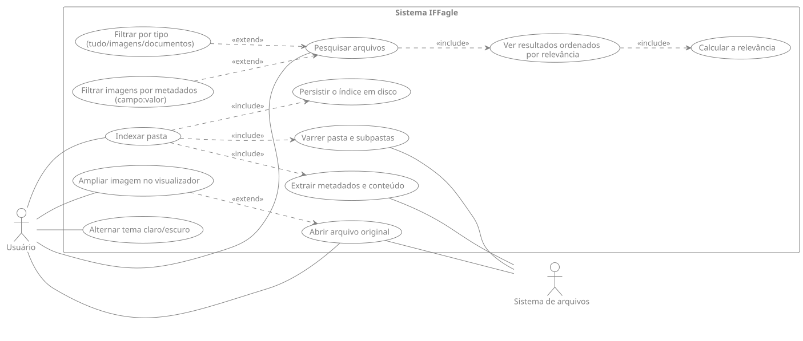

<div align="center">


Trabalho Integrador 1 · Desafios de Programação · Bacharelado em Ciência da Computação
· IFFar — _Campus_ Frederico Westphalen


</div>

---

### Alunos

- Cauã Felipe Ziotti Tamiozzo
- Diego Breskovit Morcelli
- Talita Vargas de Souza

### Índice

1. [Introdução](#introdução)
2. [Como executar](#como-executar)
3. [Tecnologias utilizadas](#tecnologias-utilizadas)
4. [Estrutura de pastas](#estrutura-de-pastas)
5. [Como o sistema funciona](#como-o-sistema-funciona)
6. [Estruturas de dados utilizadas](#estruturas-de-dados-utilizadas)
7. [Cálculo da relevância](#cálculo-da-relevância)
8. [Guia de uso dos filtros de metadados](#guia-de-uso-dos-filtros-de-metadados)
9. [Limitações conhecidas](#limitações-conhecidas)
10. [Requisitos implementados](#requisitos-implementados)

## Introdução

O IFFagle percorre uma vez a pasta escolhida, extrai o que cada arquivo tem
de pesquisável (metadados, no caso das imagens; texto e frequência de palavras,
no caso dos documentos) e guarda isso numa **Trie** - uma árvore de prefixos
construída pelo grupo. A partir daí, toda pesquisa consulta apenas a árvore: não
é preciso varrer os diretórios de novo.

## Como executar

O projeto usa o [UV](https://docs.astral.sh/uv/). Depois de instalado, navegue até `Trabalho1/`:

```bash
uv run python app.py          # http://127.0.0.1:5000
```

> O `uv run` já cria o ambiente virtual, baixa o Python 3.14 e instala as
> dependências travadas no `uv.lock`. Não é preciso `venv` nem `pip`.
> Para instalar sem executar nada, use `uv sync`.

Com a aplicação no ar:

1. Clique em **Indexar pasta** e informe o caminho completo de uma pasta
   (a `pasta_teste/` deste repositório serve como amostra pronta).
2. Pesquise pela home. Use as abas **Tudo / Imagens / Documentos** para
   filtrar por tipo e os [filtros de metadados](#guia-de-uso-dos-filtros-de-metadados)
   para refinar a busca de imagens.
3. Clique num resultado para abrir o arquivo; nas imagens, o clique abre o
   visualizador ampliado.

> O índice fica salvo em `storage/indice.pkl`, então ele sobrevive a um
> reinício do servidor. Se você mexer nos arquivos da pasta, **reindexe**
> para o índice refletir as mudanças.

## Tecnologias utilizadas

| Tecnologia             | Papel no projeto                                                 |
| :--------------------- | :--------------------------------------------------------------- |
| **Python 3.14**        | Linguagem base; toda a indexação e busca usa a biblioteca padrão |
| **Flask 3.0.3**        | Servidor web e rotas                                             |
| **Pillow 12**          | Leitura dos metadados das imagens e detecção de tons de cinza    |
| **uv**                 | Gerenciador de ambiente e dependências (`pyproject.toml` + `uv.lock`) |
| **Tailwind CSS** (CDN) | Estilo da interface, incluindo o tema claro/escuro               |
| **pickle**             | Persistência do índice em disco                                  |

## Estrutura de pastas

```
iffagle/
├── app.py                          # Flask: rotas /, /indexar, /buscar, /arquivo
├── core/
│   ├── config.py                   # extensões suportadas, limites, caminho do índice
│   ├── scanner.py                  # varredura de diretórios (ignora o sem permissão)
│   ├── indexer.py                  # orquestra varredura + extração + inserção na Trie
│   ├── relevance.py                # contagem das palavras mais comuns de um documento
│   ├── search.py                   # busca, filtros por campo e ordenação por relevância
│   ├── extractors/
│   │   ├── image_extractor.py      # metadados via Pillow + termos de busca da imagem
│   │   └── text_extractor.py       # leitura do conteúdo de .txt
│   └── trees/
│       ├── __init__.py             # IndicesArquivos: uma Trie para imagens, outra para documentos
│       └── trie.py                 # a Trie em si (NoTrie, inserir, buscar, buscar_prefixo)
├── storage/
│   ├── persistence.py
│   └── indice.pkl
├── templates/
│   ├── base.html
│   ├── index.html
│   ├── indexar.html
│   └── resultados.html
├── static/
│   └── logo.svg
├── pasta_teste/
└── T1.pdf
```

## Como o sistema funciona (Diagrama de Caso de Uso)



## Estruturas de dados utilizadas

Para a indexação e busca dos arquivos, foi implementada uma Trie (árvore de prefixos), desenvolvida integralmente pelo grupo, sem uso de bibliotecas prontas de estrutura de dados. Cada nó da Trie (NoTrie) representa um caractere e mantém um dicionário de filhos, uma flag indicando se aquele nó corresponde ao fim de uma palavra válida e, quando é o caso, um dicionário associando cada arquivo à quantidade de vezes que a palavra ocorre nele. Essa escolha foi motivada por três fatores:

- Busca por prefixo eficiente: como o sistema precisa oferecer uma experiência de pesquisa nos moldes de um buscador (similar ao Google), a Trie permite localizar todas as palavras que começam com um determinado termo percorrendo apenas os caracteres do prefixo buscado, sem precisar varrer toda a base de palavras indexadas diferente do que ocorreria com uma lista ou uma tabela hash simples.

- Compartilhamento de prefixos comuns: palavras com prefixos iguais (ex.: "relatorio" e "relacionamento") compartilham o mesmo caminho inicial na árvore, reduzindo redundância de armazenamento em relação a estruturas que tratam cada palavra de forma independente.

- Base natural para o cálculo de relevância: por armazenar, em cada nó de fim de palavra, a frequência de ocorrência por arquivo, a Trie já fornece diretamente o dado necessário para o cálculo de relevância dos documentos (frequência do termo buscado no conteúdo de cada arquivo), exigido pelo trabalho.

Como o sistema precisa manter índices separados para imagens e documentos, foi criada a classe IndicesArquivos, que encapsula duas instâncias independentes da Trie — uma para o índice de imagens e outra para o índice de documentos — expondo um método (arvore_para_tipo) que resolve qual árvore deve ser utilizada de acordo com o tipo de arquivo pesquisado.

### Custo das operações

Sendo `m` o tamanho da palavra buscada e `k` a quantidade de palavras sob o
prefixo, independentemente de quantos arquivos existam no índice:

| Operação                    |  Custo   | Onde é usada                    |
| :-------------------------- | :------: | :------------------------------ |
| `inserir(palavra, arquivo)` |   O(m)   | Indexação                       |
| `buscar(palavra)`           |   O(m)   | Peso extra para a palavra exata |
| `buscar_prefixo(prefixo)`   | O(m + k) | Busca principal                 |

## Cálculo da relevância

Durante a indexação, cada palavra do documento é inserida na Trie **uma vez
para cada ocorrência** no texto. O nó final acumula, então, a frequência da
palavra naquele arquivo. Na busca, a relevância de um arquivo é:

```
relevância = Σ (ocorrências do prefixo)  +  Σ (ocorrências da palavra exata) × BONUS_PALAVRA_EXATA
```

Ou seja: quem cita mais o termo sobe, e quem escreveu a **palavra inteira**
fica acima de quem só casou pelo prefixo. Quando a busca tem vários termos,
eles funcionam como **E** e as pontuações
se somam. A ordenação final é decrescente por essa nota, feita em
`core/search.py`.

Exemplo real, indexando a `pasta_teste/`:

```
q="estoque"   →  relatorio_estoque.txt  12.00    (5 ocorrências no texto + o nome do arquivo)
                 relatorio_vendas.txt    2.00    (cita "estoque" uma vez)

q="rela"      →  relatorio_vendas.txt    3.00
                 relatorio_estoque.txt   2.00
                 ata_reuniao.txt         2.00    (casou por "relacionamento")
```

## Guia de uso dos filtros de metadados

Vale para a busca de **imagens** (aba "Imagens" ou "Tudo"). A consulta aceita
dois formatos, que podem ser misturados:

- **Filtro por campo** — `campo:valor`, ex.: `tipo:png`.
- **Termo livre** — palavra solta, ex.: `paisagem`, `1920x1080`, `colorida`.

Vários termos funcionam como **E**: o arquivo precisa casar com todos eles.
O `+` vale como separador, igual ao espaço.

```
praia tipo:jpg                    imagem jpg com "praia" no nome
tipo:jpg+orientacao:horizontal    jpg na horizontal
tipo:jpg orientacao:vertical      sem resultados se nenhuma jpg for vertical
1920x1080 colorida                por dimensão exata e por cor
```

> Códigos usados na busca por metadados

| Campo        | Valores                              | Descrição                                          |
| :----------- | :----------------------------------- | :------------------------------------------------- |
| `tipo`       | `jpg`, `jpeg`, `png`                 | Formato do arquivo                                 |
| `orientacao` | `horizontal`, `vertical`, `quadrada` | Largura vs. altura                                 |
| `cor`        | `colorida`, `pb`                     | Tem cor ou é tons de cinza                         |
| `tamanho`    | `grande`, `media`, `pequena`         | Resolução: ≥ 1920px / entre / ≤ 400px (maior lado) |
| `peso`       | `leve`, `moderada`, `pesada`         | Arquivo: < 100 KB / entre / > 2 MB                 |
| `ano`        | `2024`, `2025`, ...                  | Ano da última modificação                          |

> Termos de busca por metadados em busca livre

| Metadado   | Termos aceitos                                                               |
| :--------- | :--------------------------------------------------------------------------- |
| Formato    | `jpeg`, `png`                                                                |
| Dimensões  | `1920x1080`, ou só a largura (`1920`) ou a altura (`1080`)                   |
| Orientação | `paisagem`/`horizontal`, `retrato`/`vertical`, `quadrada`                    |
| Resolução  | `grande` (≥ 1920px), `media`, `pequena` (≤ 400px)                            |
| Cor        | `colorida`/`cor`/`color`, ou `pb`/`preta`/`branca`/`cinza`/`bw`/`grayscale`; |
| Peso       | `leve` (< 100 KB), `moderada`, `pesada` (> 2 MB)                             |
| Ano        | `2024`, `2025`, ...                                                          |

Os filtros por campo (`tipo:`, `orientacao:`, …) são os mais previsíveis, porque
cada valor é único. Os termos livres são mais soltos: casam por prefixo e
convivem com as palavras do nome do arquivo.

## Limitações conhecidas

| Limitação                      | Detalhe                                                                                                       |
| :----------------------------- | :------------------------------------------------------------------------------------------------------------ |
| **Formatos de documento**      | Só `.txt`. PDF, DOCX e afins não são lidos (a extensão cai em "ignorado")                                     |
| **Acentuação**                 | A tokenização preserva acentos, então `relatorio` **não** encontra `relatório`                                |
| **Reindexação manual e total** | É preciso reindexar. Não há indexação incremental nem detecção automática de mudanças                         |
| **Um índice global**           | O índice é uma variável única do processo Flask: todos os acessos simultâneos enxergam a mesma pasta indexada |
| **Metadados de imagem**        | Apenas dimensões, formato, modo de cor, peso e data de modificação. Não há leitura de EXIF (câmera, GPS)      |
| **Memória**                    | A Trie vive inteira na RAM; o consumo cresce com a quantidade de palavras distintas indexadas                 |

## Requisitos implementados

| #   | Objetivo                                         | Onde                                         |
| :-- | :----------------------------------------------- | :------------------------------------------- |
| 1   | Selecionar uma pasta para indexação              | `templates/indexar.html` + rota `/indexar`   |
| 2   | Percorrer a pasta e suas subpastas               | `core/scanner.py::varrer_pasta`              |
| 3   | Identificar os arquivos encontrados              | `core/scanner.py::classificar_arquivo`       |
| 4   | Armazenar informações relevantes de cada arquivo | `Indexador.registro_arquivos`                |
| 5   | Construir uma estrutura do tipo Árvore           | `core/trees/trie.py`                         |
| 6   | Índice separado para imagens e documentos        | `core/trees/__init__.py::IndicesArquivos`    |
| 7   | Pesquisar por nome e tipo de arquivo             | `core/search.py` + abas em `resultados.html` |
| 7.1 | Imagens: pesquisar por metadados                 | `image_extractor.py::gerar_termos_por_campo` |
| 7.2 | Documentos: pesquisar pelo conteúdo              | `text_extractor.py` + `indexer.py`           |
| 9   | Calcular uma medida de relevância                | `relevance.py` + `search.py`                 |
| 10  | Ordenar os resultados pela relevância            | `core/search.py` (ordenação final)           |
| 11  | Disponibilizar os resultados numa aplicação web  | `app.py` + `templates/`                      |
| 12  | Permitir visualizar/acessar os arquivos          | Rota `/arquivo` + visualizador de imagens    |
| 13  | Relatório sobre estruturas e algoritmos          | Este README                                  |
